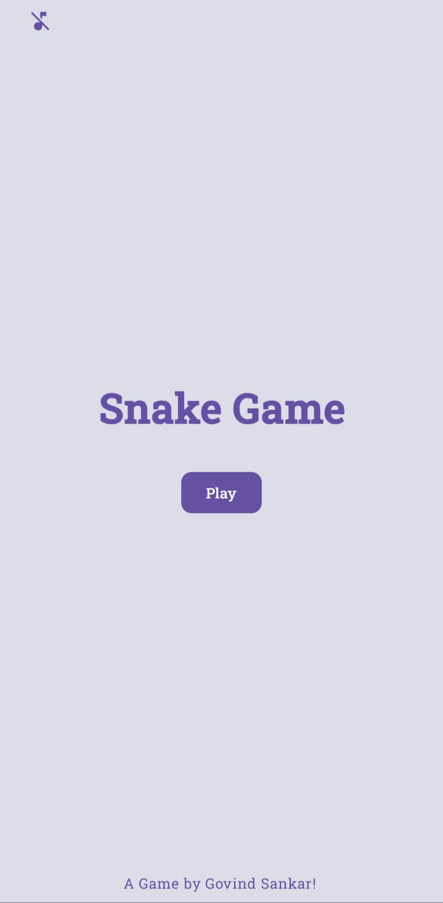
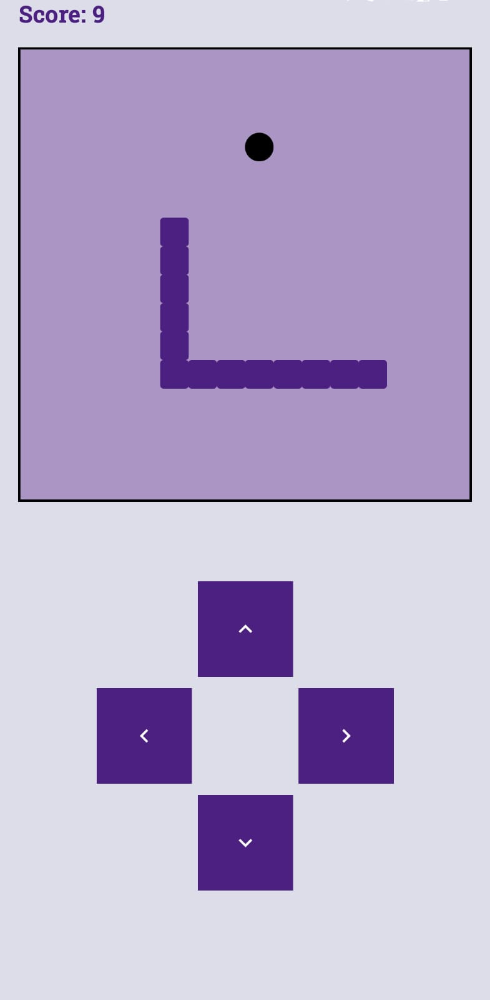

# Snake Game

A simple Snake Game made for Android Phones using Kotlin and Jetpack Compose.

## Download:
<a href = https://github.com/Govind-Sankar/Snake-Game/releases>

</a> <!-- <a href = https://github.com/Govind-Sankar/Snake-Game/releases>

</a> -->

## 🖼️ Screenshots

  


## 📦 How to Install

1. Download the latest APK from the [Releases](https://github.com/Govind-Sankar/Snake-Game/releases) section.
2. Transfer the APK to your Android device.
3. Enable installation from unknown sources.
4. Open the APK and install it.

## 🚀 Getting Started (for developers)

Clone this repo:
   ```bash
   git clone https://github.com/Govind-Sankar/Snake-Game.git
   ```

## 📄 License

This project is licensed under the [Apache License 2.0](LICENSE).
